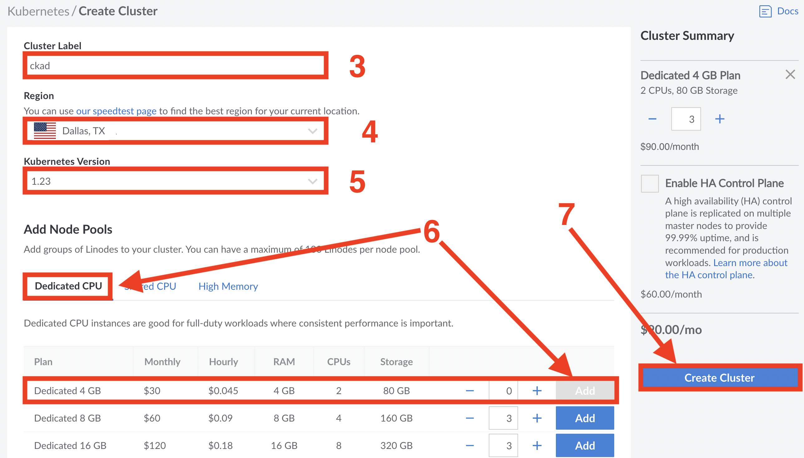

# README

Welcome to the Getting Started with Kubernetes workshop!

Complete the following sections to build a lab environment. The steps may look complicated, but they're not.

1. Install `kubectl` and `git`
2. Sign-up to Linode ($100 free credit included)
3. Create a Kubernetes cluster on Linode
4. Connect to your Kubernetes cluster
5. Clean-up

## 1. Install `kubectl` and `git`

**Install kubectl**

- Instructions for [Mac](https://kubernetes.io/docs/tasks/tools/install-kubectl-macos/#install-with-homebrew-on-macos)

- Instructions for [Windows](https://kubernetes.io/docs/tasks/tools/install-kubectl-windows/#install-kubectl-on-windows)

**Install git**

- MacOS: `brew install git`

- Windows: Download the installation exe from [here](https://git-scm.com/download/win) and follow the installation wizard.

You should quit and re-open your terminal.

## 2. Sign-up to Linode

Go to [linode.com](https://login.linode.com/signup?promo=kubeconna2022NP) and complete your sign-up. This link includes $100 of free credit to pay for your cluster during the workshop.

## 3. Create a Kubernetes cluster on Linode

You must be logged in to linode.com to complete the following steps.

1. Select **Kubernetes** on the left-hand navigation pane
2. Choose `Create Cluster` and set the following options
3. **Cluster label:** Give your cluster a name such as **gsk**
4. **Region:** Dallas, TX 
5. **Kubernetes Version:** 1.23 (newer versions will also work)
6. **Add Node Pools:**  Click `Dedicated CPU` and click the blue `Add` button at the end of the **Dedicated 4 GB** line (this will add 3 x 4GB nodes)
7. When your settings match the image below, click `Create Cluster`



It may take a couple of minutes for your cluster to be ready.

## 4. Connect to your Kubernetes cluster

You must be logged in to linode.com to complete the following steps.

1. Click **Kubernetes** on the left-hand navigation pane
2. Click the `Download kubeconfig` link for your cluster (the download will fail if your cluster is still being created)
3. Copy the downloaded file to the hidden `./kube` folder in your home directory
    - If you already have a file called `config` in your hidden `./kube` folder, rename the existing file to `config.bkp`
    - Rename the file you just downloaded from Linode and copied to your hidden `./kube` folder to `config`. Be sure the file is called `config` and **not** something like `config.yml`.
4. Open a terminal and type the following command. Your output should look similar

```
kubectl get nodes
NAME                           STATUS   ROLES    AGE     VERSION
lke76472-118784-634d2eb30838   Ready    <none>   5m23s   v1.23.6
lke76472-118784-634d2eb32f20   Ready    <none>   5m21s   v1.23.6
lke76472-118784-634d2eb354b1   Ready    <none>   4m51s   v1.23.6
```

**Congratulations, you're connected to your Kubernetes cluster.**


## 5. Clean-up

Run the following steps after the workshop is finished to shut down your lab and return to your pre-lab settings.

You must be logged in to Linode.com to complete these steps.

**Delete your Kubernetes cluster**

1. Click `Kubernetes` in the left navigation pane. Your cluster will be listed.
2. Click the `Delete` button on the far right of your cluster and follow the prompts. If you have other clusters, be sure to delete the cluster used for the workshop. You may be prompted to type the name of your cluster as confirmation of the operation.

**Delete other Linode resources**

If you have other resources and clusters on Linode, be sure you only delete resources that were part of the workshop.

1. Click `NodeBalancers` and delete any NodeBalancers created as part of the lab.
2. Click `Volumes` and clik the three dots to the far right of each volume created as part of the workshop. Choose `Delete` from the list and follo the prompts.

**Revert your `kubeconfig`**

If you already had `kubectl` installed, you will need to revert to your saved `kubeconfig` file.

1. Navigate to the hidden `./kube` folder in your home folder
2. Delete the file called `config`
3. Rename the `config.bkp` file to `config`

Your `kubeconfig` is now reverted to it's pre-workshop configuration.
